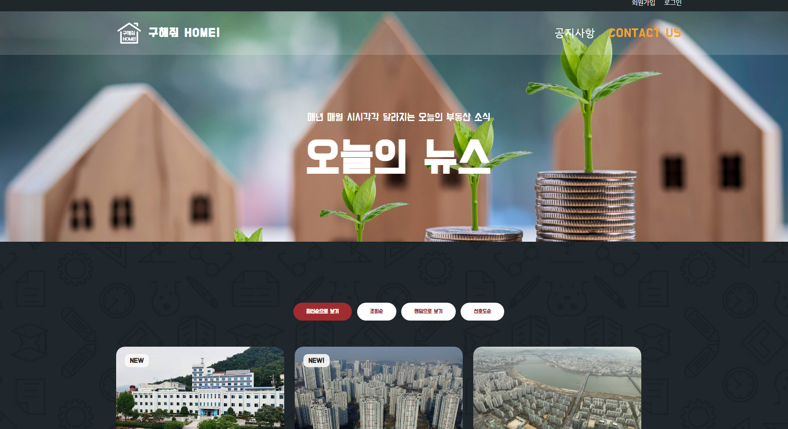

# WhereIsMyHome_2_FrondEnd_10조_김송빈_김승섭

|평가항목|점수|
|:---:|:---:|
|메인페이지 및 메뉴 구성                            |<!--점수체크란>-->   | 
|회원관리 페이지                                                     |   |
|로그인/로그아웃 페이지                                               |   |
|실거래가 조회, 결과 페이지                                           |   |
|비밀번호 찾기/사이트맵/메뉴구성 화면                                  |   |
|관심 지역 등록 / 수정 / 삭제 환경 관련 정보 제공                      |   |
|웹사이트 소개/ 공지사항관리 화면                                     |   |

# # 부울경 3반 10조 2차 관통프로젝트

# 1. 메인페이지 및 메뉴 구성

* 최상단 헤더에는 로그인, 회원등록으로 이어지는 메뉴가 있고, 
* 아래 서브 헤더 좌측에는 로고와 우측에는 공지사항, 관련 뉴스, Contact us [연락처 푸터 연결] 메뉴가 있다  

* 흐릿한 메인 검색 컨테이너에 마우스를 올리면 서서히 커지고 선명해진다. 
* 지역을 선택할 수 있는 dropdown 버튼과 검색하는 버튼을 배치하였다. 이동 버튼을 누르면 정보가 담긴 지도 섹션으로 이동한다. 

* 그 아래로 스크롤하면 실거래 정보와 기타 기능을 담은 섹션이 나온다. 

* 구해줘 홈 사이트 설명보기를 클릭하면 사이트 설명을 담은 캐러셀이 펼쳐진다. 
* 사진은 슬라이드되며 사진 상단에 제목과 아래에 설명 텍스트가 출력된다.  

* Contact us 메뉴를 클릭하면 연락처와 홈페이지 등의 정보가 기재된 footer로 슬라이드된다. 
* ssafy~를 누르면 SSAFY 홈페이지로, 바로가기를 누르면 지도 사이트로 연결된다. 

# 2. 회원관리 페이지

# 3. 로그인/로그아웃 페이지

# 4. 실거래가 조회, 결과 페이지 (관심 지역 등록 / 수정 / 삭제 버튼 포함)

* 검색된 지역에 관련된 항목의 위치가 지도 상에 마크표시되고, 왼쪽 카드 섹션에 표시된 항목들의 정보가 표시된다. 
* 또한 해당 카드 섹션에서 관심 항목 등록, 삭제를 할 수 있다. 

# 5. 비밀번호 찾기/사이트맵/메뉴구성 화면

* 메뉴 구성 페이지 중 부동산 관련 소식을 담은 페이지이다.
* 클릭하면 해당 뉴스 사이트로 이동한다.

# 6. 웹사이트 소개/ 공지사항관리 화면

* 웹사이트를 소개하는 펼쳐지는 캐러셀이 3장으로 구성돼있다. 클릭을 하면 좌우로 넘어간다.  

